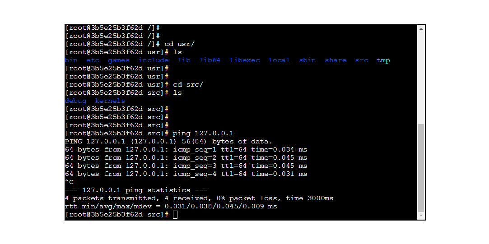

<h1>Web Terminal For Docker</h1>

1, git clone https://github.com/lanbiter/Docker-console.git

2, pip install -r requirements.txt

3, edit /etc/default/docker add DOCKER_OPTIONS="-H unix:///var/run/docker.sock -H 0.0.0.0:2375" or /etc/sysconfig/docker-network,add  DOCKER_NETWORK_OPTIONS="-H unix:///var/run/docker.sock -H 0.0.0.0:2375" or /lib/systemd/system/docker.service ,and then restart docker service

4, vim configure.py

5, fix DOCKER_HOST and DOCKER_API_VERSION according to your own situation and set timeout

6, choice a containerID(running) in you DOCKER_HOST and set CONTAINER_ID

7, execute start.sh and visit http://(website):5000/

打赏：

